<div align="center">

# Affinity

Map your tech role to a Hunter x Hunter Nen type and see why affinity, not effort, sets your ceiling

[![Live][badge-site]][url-site]
[![HTML5][badge-html]][url-html]
[![CSS3][badge-css]][url-css]
[![JavaScript][badge-js]][url-js]
[![Claude Code][badge-claude]][url-claude]
[![License][badge-license]](LICENSE)

[badge-site]:    https://img.shields.io/badge/live_site-0063e5?style=for-the-badge&logo=googlechrome&logoColor=white
[badge-html]:    https://img.shields.io/badge/HTML5-E34F26?style=for-the-badge&logo=html5&logoColor=white
[badge-css]:     https://img.shields.io/badge/CSS3-1572B6?style=for-the-badge&logo=css3&logoColor=white
[badge-js]:      https://img.shields.io/badge/JavaScript-F7DF1E?style=for-the-badge&logo=javascript&logoColor=black
[badge-claude]:  https://img.shields.io/badge/Claude_Code-CC785C?style=for-the-badge&logo=anthropic&logoColor=white
[badge-license]: https://img.shields.io/badge/license-MIT-404040?style=for-the-badge

[url-site]:   https://affinity.neorgon.com/
[url-html]:   #
[url-css]:    #
[url-js]:     #
[url-claude]: https://claude.ai/code

</div>

---

## Overview

Affinity borrows the Nen efficiency chart from Hunter x Hunter and applies it to tech careers. Each of the six Nen types maps to a base engineering role, and the same rule holds: you work at 100% in your born type and lose about 20% for every step away from it. It exists to explain, without judgment, why effort alone does not close a career gap, why AI amplifies the affinity you already have instead of granting a new one, and why the Specialist role cannot be chased directly.

This is an internal, unlisted tool. It is not indexed and does not appear on the Neorgon hub.

**Live:** affinity.neorgon.com

---

## The model

- **Enhancement** -- Backend / Core Engineering (reinforce what exists)
- **Transmutation** -- Data / ML Engineering (give raw material new properties)
- **Conjuration** -- Frontend / Product Engineering (manifest what users see)
- **Specialization** -- Architect / Staff+ / Strategist (fits no other category)
- **Manipulation** -- Engineering Management / PM / TPM (direct people and process)
- **Emission** -- DevOps / SRE / Platform / Infra (project power at a distance)

Opposites (three steps apart on the hexagon) are the hardest crossings: Emission ↔ Conjuration (infra ↔ frontend) sits at 40%, the exact example this tool is built to explain.

---

## Features

- **Interactive affinity hexagon** -- pick your born type and watch every other corner recompute to 100 / 80 / 60 / 40
- **Six role cards** -- each Nen type, its tech role, signature strengths, what to watch for, and what AI actually does for it
- **AI amplification calculator** -- choose who you are and what you are asked to do, then pour AI in with a slider; low-affinity work stays capped no matter how much AI is applied
- **Find-your-type quiz** -- five questions that surface your closest affinity (and any strong dual)
- **The Specialist explainer** -- why the Architect corner cannot be trained into directly, grounded in Chrollo, Kurapika, and innate powers

---

## Running locally

ES modules require an HTTP server (not `file://`):

```bash
make serve   # http://localhost:8855
```

---

## Architecture



```
affinity-site/
├── index.html          # App shell + quiz/calculator modals
├── css/
│   └── style.css        # Design tokens + hexagon, cards, calculator styles
├── js/
│   ├── app.js           # Entry point (<50 lines)
│   ├── state.js         # Born type, quiz answers, slider (localStorage)
│   ├── data.js          # Six types, efficiency() + withAI() math, quiz, Specialist copy
│   ├── render.js        # Hexagon, role cards, Specialist section
│   ├── views.js         # Quiz and AI calculator modal views
│   ├── events.js        # Hexagon / quiz / calculator wiring + modal focus trap
│   └── utils.js         # escHtml, $ element cache
└── docs/
    └── architecture.mmd # Mermaid source for the diagram above
```

---

<div align="center">
<sub>Part of <a href="https://neorgon.com/">Neorgon</a></sub>
</div>
