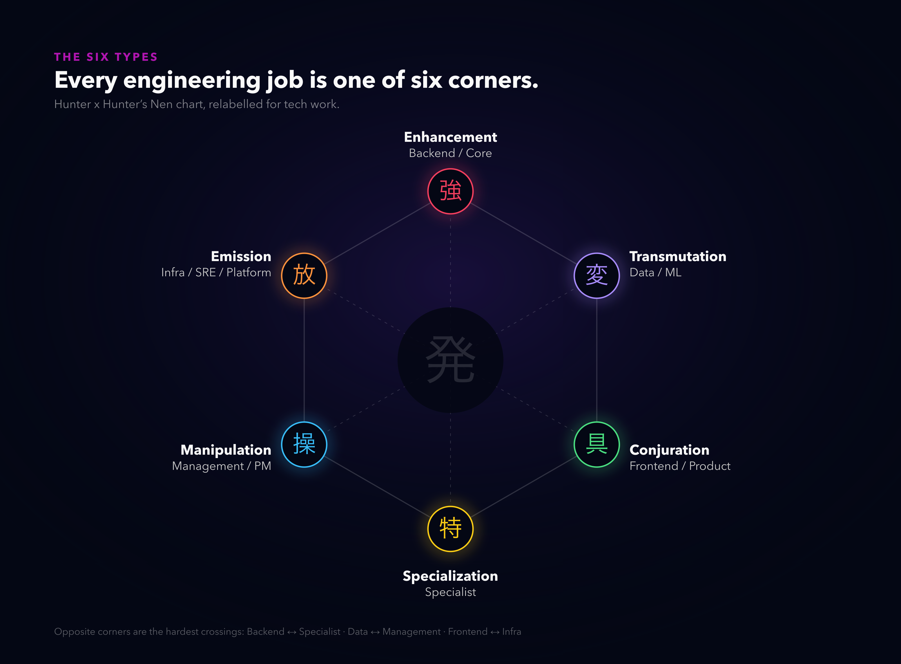
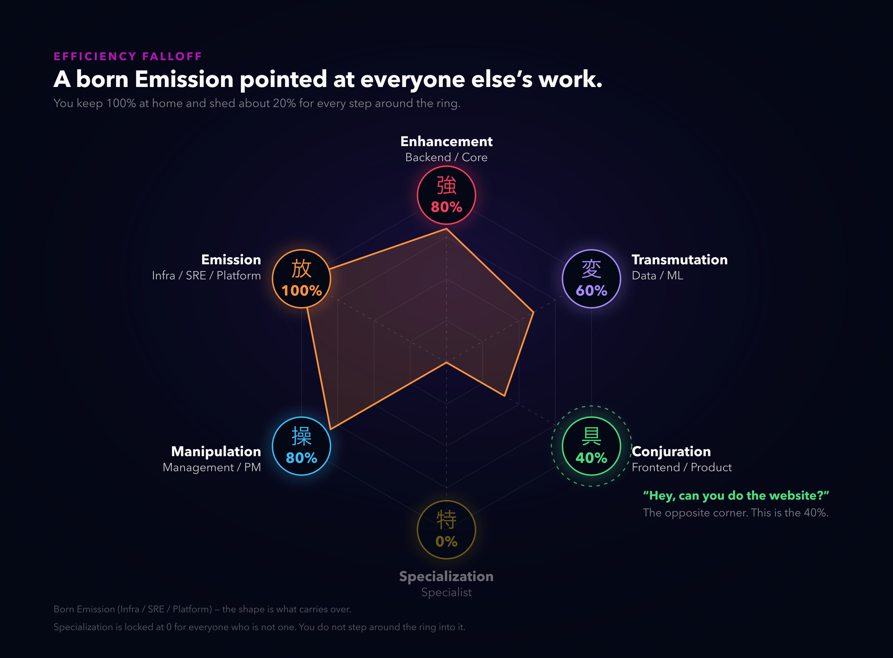
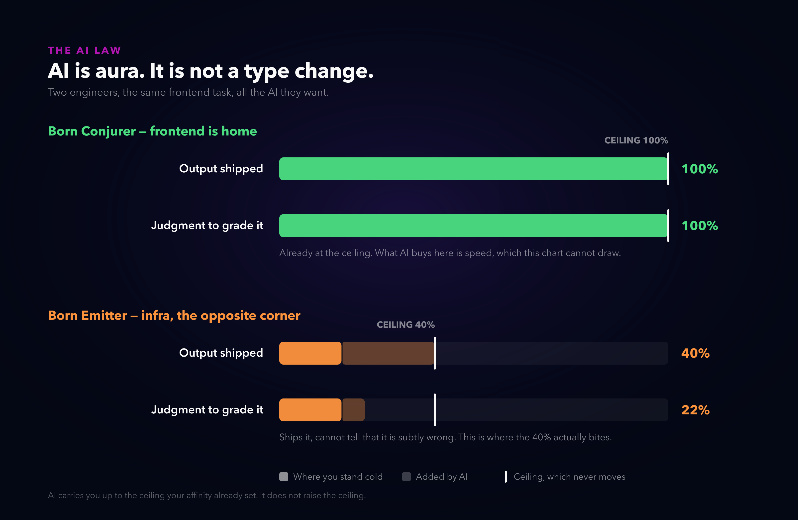
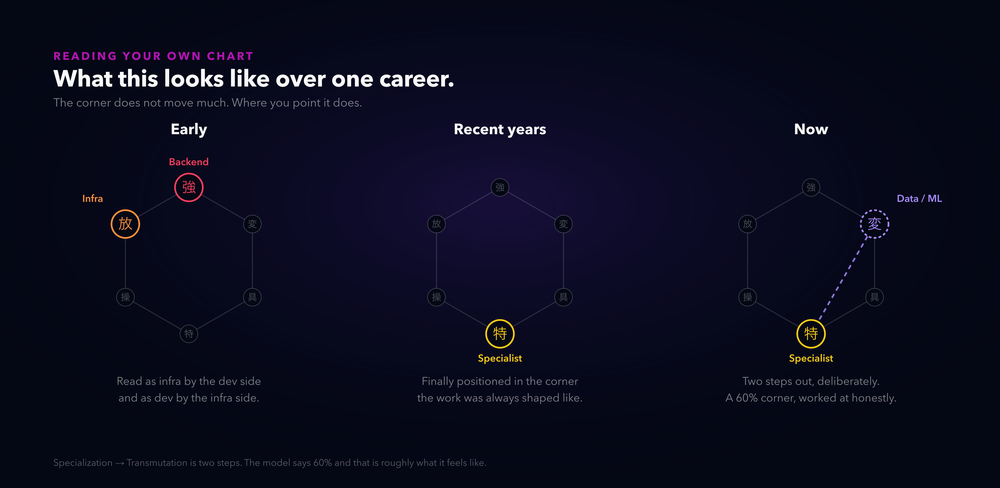

# Nen efficiency, but for tech jobs

*Alternate titles: "Your job is a Nen type" · "The 40% problem" · "AI is aura, not a type change"*

---

So hear me out. It may be a little cringe, but let me cook.

For a couple of years I've been building personal theories about work and profiles. Most can wait. This one might hold up, because with the current season of AI profile refitting, things have gotten weird.

From where I sit it's obvious who can and can't do work outside their own lane, even handed AI. The person has a knack for it or doesn't. AI speedruns your progress and then you stop, especially if you don't have the criteria to judge what you just produced.

Here's the distinction I care about. If you could already do something and time was the only thing in the way, now you can do it. That part is real. It doesn't mean you can do something that was outside your skills, or rival people who are genuinely good at it.

So, again, before sleeping, I landed on a system that explains it, and you may already know it: **Nen efficiency**. Hopefully you've read or watched Hunter x Hunter, because the categories and the efficiency rule are the part that carries over.

Same rules apply. You can train to 100% in your own category. Specialization is 0% if you aren't one. If you're infrastructure, you can play in infrastructure all you want.

Now what if I say "hey, do websites"? What's your expected efficiency?

Yes. 40%.

And it's a decent 40%. You're bringing enough skill to avoid the default AI slop. It's still the opposite corner.

## What AI actually changes

This is the part I think people get wrong. AI doesn't move you to another corner. It gives you more aura in the corner you're already standing in.

And more aura doesn't improve your conversion rate. In the manga the percentage *is* the rate. A Conjurer pouring everything they have into Emission still converts at 40%. They get more out of it. They don't get better at it.

So yes, the infra person with AI ships the website now, and fast. What happened is they reached their own ceiling in a week instead of in three years. That's genuinely new and it's worth a lot. The ceiling didn't move.

Which is the criteria problem again. Someone native to that corner catches the bad suggestion. You ship it, and it looks fine to you.

Honestly, most of the time 40% is more than the situation needed. The site works, it's up, nobody's complaining. It matters the moment it *does* need to be good, because no amount of AI will tell you which part isn't.

## Where to point it

If AI takes you up to your ceiling rather than past it, then the order you use it in stops being arbitrary.

Reinforce your own corner first. Biggest return, and the step everyone skips because it's the least exciting one. You have the judgment to catch a bad suggestion there, so speed compounds instead of quietly piling up mistakes.

Then the corners next to yours, where most of the craft carries over.

Then across the chart, knowingly, with someone native reviewing. Not instead of hiring one.

## "So a developer can't become a PM?"

First thing someone asked me, and it's the right question. Nobody starts as a manager. If the corner were fixed at birth, either every good manager was secretly always one, or the model is broken.

The fix is to stop conflating two things. Your **affinity** is the corner your judgment came from, and it moves slowly. Your **role** is the corner your job is in, and it moves whenever your job does. A developer who becomes a PM doesn't turn into a different type. They become a PM with engineering judgment: strong on feasibility, estimates and unblocking, and finding the political half expensive.

That's a forecast about what kind of PM you'll be. It was never a gate on being one.

Nobody is born knowing their corner either, so the test can run twenty years late and still come back accurate. If the new corner got cheap after two or three years, it was yours and you found it late. If it's still expensive, you're paying rent, which can absolutely still be worth it.

## My own chart

I always struggled between infra and dev, mostly because people read me as whichever category I wasn't in at the time.

And sure, a 100% person looking at someone at 40 or 60% in their corner is thinking "yeah, you're not really here." Fair.

In recent years I've been able to position myself in Specialization and work from there, which has helped me develop a lot. And for about two years I've been pushing into another category. Currently Transmutation.

I went back and forth on what to even call that corner. "Architect" is a title with a job description attached, and the description is always narrower than the work. "Subject matter expert" is closer and still wrong, because you get there by spending enough years on one subject, and a corner you can reach with time and effort is not this corner. So it keeps the manga's word. There isn't a job title for it yet. It's hard to describe, and when someone has it, people can tell.

I know assigning yourself Specialist is a bit self-centered. But well, if the shoe fits.

## Where this breaks

Plenty. A few worth saying out loud before someone says them for me.

The numbers come from a manga. Nobody measured a frontend engineer working in a backend codebase against a control group. Treat 80 / 60 / 40 as an ordering, not a measurement. Seniority is a whole axis this can't see either: a new grad and a principal both read 100% in their corner.

And read the number twice. Today it's a ceiling, the best you can currently do in that corner, and no tool raises it. Over years it's a price: training moves your affinity, and the number moves with it. AI changes how fast you reach today's ceiling and nothing at all about the cost of raising it.

Please don't use this on other people. It's a mirror, not an assessment. The moment "he's an Emitter" becomes a reason not to staff someone on a project, it has done more damage than the insight was worth.

Still, it's a decent way to translate the reasoning behind my own decisions and actions.

---

*I built it as a clickable thing if you want to try your own chart: [affinity.neorgon.com](https://affinity.neorgon.com/)*

*Hunter x Hunter and Nen are the work of Yoshihiro Togashi, published by Shueisha. This is unaffiliated commentary.*
